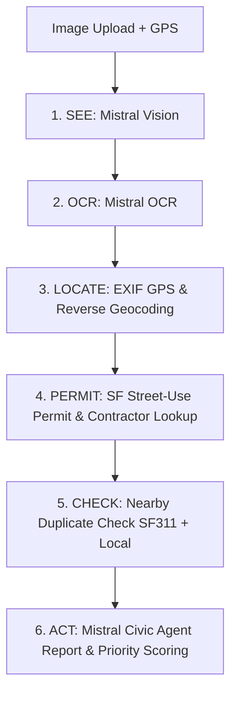

# Roadar 🚧

**Turn every camera into an autonomous road inspector.**

Roadar turns street-level photos into structured, prioritized municipal infrastructure reports powered by **Mistral AI**.


---

## 🌟 Key Features

- **Multimodal Hazard Detection**: Classifies potholes, road debris, blocked lanes, flooding, collisions, and damaged signage.
- **Mistral OCR Integration**: Extracts street text, route shields, and sign writing.
- **SF Street Use Permit Lookup**: Cross-references EXIF GPS / Nominatim road names against live San Francisco Active Street Use Permits to identify active contractors and contact phone numbers.
- **SF311 Duplicate Detection**: Cross-checks nearby Roadar records and live SF311 open data within a 25-meter spatial radius.
- **Autonomous Municipal Reporting**: Generates 311-formatted reports, priority score and flags critical hazards/collisions for human review.
- **Interactive Map Dashboard**: Next.js web app with Leaflet map canvas, hazard filters, citizen upvoting, contractor detail panels, and simulated municipal 311 submission.

---

## 🔄 Agentic Pipeline Flow

Roadar executes a 6-step autonomous inspection pipeline:



1. **SEE** — Classifies hazard type, confidence, severity tier, and lane impact.
2. **OCR** — Extracts text and street signals from image text.
3. **LOCATE** — Extracts EXIF GPS coordinates and reverse-geocodes road names via Nominatim.
4. **PERMIT** — Queries SF Open Data to attribute roadwork permits to contractors and phone numbers.
5. **CHECK** — Spatial circle check against local `hazards` database and live SF311 reports.
6. **ACT** — Generates municipal-ready report, priority score and routing agency recommendation.

---

## 📁 Repository Structure

```
.
├── ai-service/             # Core Mistral AI pipeline (vision, ocr, geo, permit, agent)
│   └── mistral_pipeline/   # Python package for multimodal hazard analysis
├── backend/                # FastAPI REST server & Supabase database integration
│   ├── app/                # Endpoints (/analyze-image, /api/hazards, /api/observations)
│   └── tests/              # Backend & permit lookup unit tests
├── web-app/                # Next.js 15 + Tailwind CSS + Leaflet frontend
│   └── src/                # Components, hooks, map canvas, and hazard cards
├── supabase/               # SQL schema definitions, migrations & apply_all.sql
├── docs/                   # API contract documentation (API_CONTRACT.md)
└── imgs/                   # Test assets and sample road photos
```

---

## 🚀 Quick Start

### 1. Prerequisites & Environment Setup

Create a `.env` file in the root directory (or in `backend/` and `web-app/`):

```env
MISTRAL_API_KEY=your_mistral_api_key
SUPABASE_URL=https://your-project.supabase.co
SUPABASE_SERVICE_ROLE_KEY=your_supabase_service_role_key
NEXT_PUBLIC_SUPABASE_URL=https://your-project.supabase.co
NEXT_PUBLIC_SUPABASE_ANON_KEY=your_supabase_anon_key
```

### 2. Run the Backend API

```bash
cd backend
python -m pip install -r requirements.txt
uvicorn app.main:app --reload --port 8010
```

Backend OpenAPI docs will be available at [http://localhost:8010/docs](http://localhost:8010/docs).

### 3. Run Backend Unit Tests

```bash
cd backend
pytest -v
```

### 4. Run the Web Application

```bash
cd web-app
npm install
npm run dev
```

Open [http://localhost:3000](http://localhost:3000) in your browser.

---

## 📊 Database Schema Setup

To initialize the Supabase database:
1. Go to your Supabase project's **SQL Editor**.
2. Run the contents of [`supabase/apply_all.sql`](supabase/apply_all.sql) to create `hazards`, `reports`, and `observations` tables, enums, indexes, and storage buckets.

---

## 📄 Documentation

- **API Contract**: See [`docs/API_CONTRACT.md`](docs/API_CONTRACT.md) for endpoint specifications and data models.
